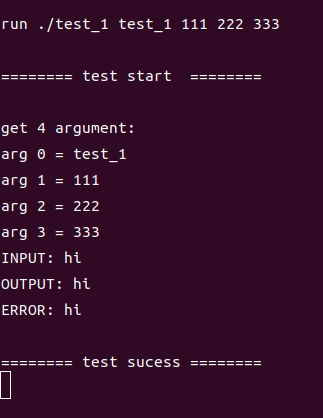
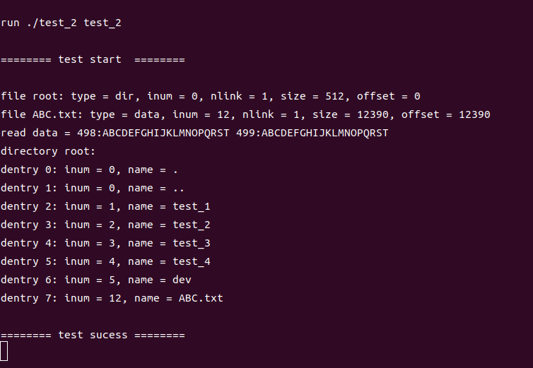
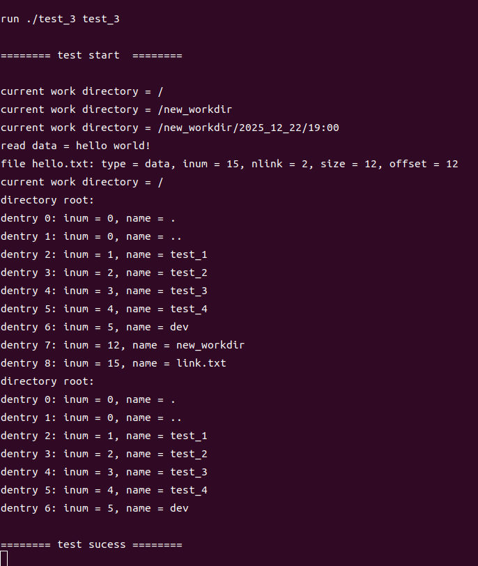
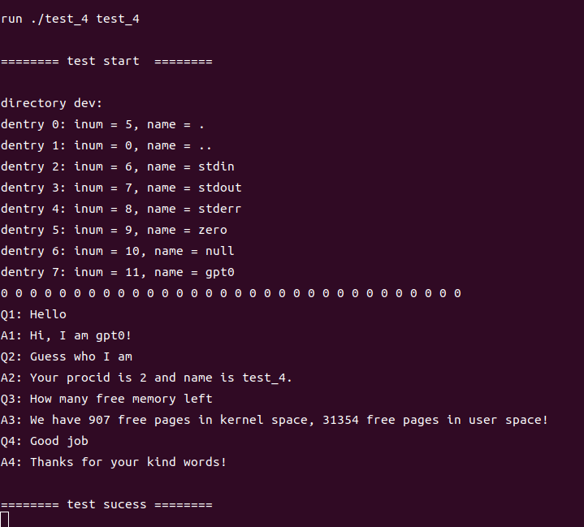

# LAB-9：文件管理与全系统整合

## 实验目标

Lab 8 已经实现 inode、文件数据读写、目录项以及绝对路径解析。本次实验在这些基础上补齐文件抽象、设备文件、相对路径和 ELF 装载，将内存管理、进程管理、文件系统和系统调用连接成一个能够执行用户程序的完整系统。

本次实验的主要目标如下：

- 完善目录项遍历、路径反向解析、文件创建、硬链接和解除链接。
- 使用 `file_t` 保存一次打开文件所需的权限、偏移和引用信息。
- 为每个进程增加当前工作目录 `cwd` 和打开文件表 `open_file[]`。
- 实现标准输入输出、`/dev/zero`、`/dev/null` 和 `/dev/gpt0` 等设备文件。
- 封装用户态文件系统 API，并补充相应的内核系统调用。
- 解析磁盘中的 ELF 文件，用 `exec` 替换进程地址空间并传递 `argv`。
- 综合验证普通文件、目录、硬链接、设备文件和用户程序执行流程。

## 全系统文件访问模型

### process、file 和 inode 的关系

本实验将一次文件访问组织为以下层次：

```text
用户态 fd
    -> proc.open_file[fd]
    -> file_t（权限、offset、ref）
    -> inode_t（类型、大小、链接数、磁盘索引）
    -> 普通磁盘数据 / 目录项 / 设备驱动函数
```

每个进程最多持有 10 个文件描述符。文件描述符只是 `open_file[]` 的下标；真正描述一次打开行为的是全局文件表中的 `file_t`：

```c
typedef struct file {
    inode_t *ip;
    bool readable;
    bool writbale;
    uint32 offset;
    uint32 ref;
} file_t;
```

`file_t` 和 `inode_t` 的职责不同：

- `inode_t` 表示文件本身，保存文件类型、大小、链接数和数据块索引，同一个 inode 可以被多个文件对象引用。
- `file_t` 表示一次打开的状态，保存本次打开的读写权限和当前位置，不写入磁盘。
- `dup()` 和 `fork()` 通过 `file_dup()` 共享同一个 `file_t`，因此共享文件偏移量；重新 `open()` 同一路径则会得到新的 `file_t` 和独立偏移量。

`file_alloc()` 在全局 `file_table` 中寻找 `ref == 0` 的槽位，并在释放锁之前将 `ref` 设为 1，避免其他 CPU 重复取得该槽位。`file_close()` 先在锁内减少引用并取出最后一个 inode 指针，再在锁外调用 `inode_put()`，避免持有自旋锁时执行可能睡眠的磁盘操作。

### 文件读写分派

`file_read()` 和 `file_write()` 根据 inode 类型选择不同后端：

```c
switch (ip->disk_info.type) {
case INODE_TYPE_DATA:
    read_len = inode_read_data(ip, file->offset,
        len, (void *)dst, is_user_dst);
    break;
case INODE_TYPE_DIR:
    read_len = dentry_transmit(ip, dst,
        len, is_user_dst);
    break;
case INODE_TYPE_DIVICE:
    read_len = device_read_data(ip->disk_info.major,
        len, dst, is_user_dst);
    break;
}
file->offset += read_len;
```

普通文件访问磁盘数据；目录读取时只传出有效目录项；设备文件则利用主设备号进入设备函数表。这样用户态始终使用 `read(fd, ...)` 和 `write(fd, ...)`，不需要知道后端是磁盘还是设备。

`file_lseek()` 支持设置、前移和后移偏移量，并对无符号溢出和下溢进行限制。`file_get_stat()` 汇总 inode 元数据和当前 `file_t` 的偏移量，再通过 `uvm_copyout()` 写入用户地址，因为用户指针不能在内核页表下直接解引用。

## 目录、路径与链接

### 有效目录项传输

目录块中被删除的目录项会留下空槽，不能直接把整块数据交给用户。`dentry_transmit()` 遍历目录块，只复制 `name[0] != '\0'` 的有效目录项：

```c
for (uint32 i = 0;
     i < DENTRY_PER_BLOCK &&
     copied + sizeof(dentry_t) <= len;
     i++) {
    dentry_t *de = &entries[i];
    if (de->name[0] == '\0')
        continue;

    if (is_user_dst)
        uvm_copyout(p->pgtbl, dst + copied,
            (uint64)de, sizeof(dentry_t));
    else
        memmove((uint8 *)dst + copied,
            de, sizeof(dentry_t));

    copied += sizeof(dentry_t);
}
```

这使 `get_dentries()` 返回的数据连续且只包含仍然存在的文件。

### 绝对路径与相对路径

`__path_to_inode()` 根据路径开头选择解析起点：

```c
if (path[0] == '/')
    ip = inode_get(ROOT_INODE);
else
    ip = inode_dup(myproc()->cwd);
```

随后 `get_element()` 逐个取出路径分量，当前 inode 必须是目录，再用 `dentry_search()` 找到下一级 inode 编号。`.` 和 `..` 不需要特殊解释，它们本身就是目录中的有效目录项，因此能够自然参与路径解析。

`inode_to_path()` 完成相反过程。它通过当前目录的 `..` 找到父目录，再调用 `dentry_search_2(parent, cur_num, name)` 在父目录中反查当前目录名称。由于得到名称的顺序是从叶子到根，所以函数从缓冲区末尾向前填充 `/name`，最后返回有效字符串的起始偏移。

### 创建文件、硬链接与解除链接

`path_create_inode()` 先解析父目录并排除空名称、`.`、`..` 和重名项，然后申请 inode。创建目录时还需要建立：

```text
.  -> 新目录自身的 inode
.. -> 父目录的 inode
```

最后在父目录中创建指向新 inode 的目录项。如果中途失败，则把新 inode 的 `nlink` 置零并调用 `inode_put()` 统一回收 inode、数据块和 bitmap。

硬链接让不同路径指向同一个普通文件 inode：

```text
link(old, new):   创建 new dentry -> old inode，nlink++
unlink(path):     删除对应 dentry，nlink--
```

本实验禁止为目录创建硬链接，以免引入除 `.` 和 `..` 之外的目录环。删除目录前还要确认除这两个目录项外没有其他有效内容。当 `nlink == 0` 且 inode 的内存引用也归零时，`inode_put()` 才最终释放文件资源，因此打开的文件不会因为路径被删除而立即失效。

## 设备文件与控制台

### 设备函数表

设备文件的 inode 不保存普通文件数据，而是使用 `major` 索引 `device_table`：

```c
typedef struct device {
    char name[MAXLEN_FILENAME];
    uint32 (*read)(uint32, uint64, bool);
    uint32 (*write)(uint32, uint64, bool);
} device_t;
```

`device_init()` 注册设备函数，并保证 `/dev` 以及下面六个设备 inode 存在：

| 设备 | 权限 | 行为 |
| --- | --- | --- |
| `/dev/stdin` | 只读 | 从控制台行缓冲读取 |
| `/dev/stdout` | 只写 | 写入 UART 控制台 |
| `/dev/stderr` | 只写 | 输出 `ERROR:` 前缀后写控制台 |
| `/dev/zero` | 只读 | 返回任意长度的零字节 |
| `/dev/null` | 读写 | 读返回 0 字节，写入直接丢弃但报告成功 |
| `/dev/gpt0` | 只写 | 对四个预设字符串给出固定回答 |

`device_open_check()` 同时检查主设备号是否越界、设备是否注册以及请求的读写方法是否存在，避免以不支持的模式打开设备。

### 行缓冲控制台

控制台维护 `read_idx`、`writ_idx` 和 `edit_idx`。UART 中断收到普通字符时写入编辑区；遇到换行或缓冲区已满时，更新 `writ_idx` 并唤醒等待输入的进程：

```text
UART 输入 -> cons_edit() -> cons.buf
                           -> proc_wakeup()
用户 read -> cons_read()  -> proc_sleep()（尚无完整行时）
```

`cons_read()` 在没有可读数据时调用 `proc_sleep(&cons.read_idx, &cons.lk)`。睡眠操作会原子地释放控制台锁，唤醒后重新获得锁，从而避免持锁等待和“检查为空后、睡眠前”丢失唤醒的问题。

## 进程文件状态

`proc_t` 新增如下字段：

```c
inode_t *cwd;
file_t *open_file[N_OPEN_FILE_PER_PROC];
```

第一个用户进程进入用户态前，文件系统完成初始化，并设置：

```c
p->cwd = inode_get(ROOT_INODE);
p->open_file[0] = file_open("/dev/stdin", FILE_OPEN_READ);
p->open_file[1] = file_open("/dev/stdout", FILE_OPEN_WRITE);
p->open_file[2] = file_open("/dev/stderr", FILE_OPEN_WRITE);
```

因此用户程序启动时天然拥有文件描述符 0、1、2。`fork()` 使用 `inode_dup()` 继承工作目录，使用 `file_dup()` 继承打开文件；父子进程因此共享同一打开文件的偏移。`proc_free()` 则关闭全部文件并归还 `cwd` 引用，防止 file 和 inode 泄漏。

`exec()` 只替换程序地址空间和寄存器现场，不创建新进程，所以 PID、父子关系、当前工作目录和打开文件表均保留。这也是实际系统中 shell 可以先重定向文件描述符、再执行新程序的基础。

## ELF 装载与 exec

### 用户程序构建

用户测试程序由 `user.ld` 链接为 ELF 文件。`mkfs` 将 `test_1.elf` 至 `test_4.elf` 作为普通文件写入 `disk.img`，因此内核可以通过 inode 接口读取和执行它们。

`kernel.ld` 和 `user.ld` 都控制段布局，但服务对象不同：内核链接脚本将内核放到约定的物理地址并导出内存边界符号；用户链接脚本从 `USER_BASE` 开始组织用户代码和数据，并生成能由 `proc_exec()` 解析的 program header。

### exec 的提交过程

`proc_exec()` 使用“先准备，后提交”的方式替换当前进程：

```text
创建新 trapframe 和新页表
    -> 根据 path 获取 ELF inode
    -> 校验 ELF header 和 program header table
    -> 按 program header 分配并加载各 LOAD segment
    -> 创建一页用户栈，复制 argv 字符串和指针数组
    -> 设置新 PC、SP、a0(argc)、a1(argv)
    -> 提交 pgtbl/tf/heap_top/ustack
    -> 销毁旧地址空间和旧 mmap 描述符
```

每个可装载段根据 ELF 权限转换为 PTE 权限：

```c
if (ph.flags & ELF_PROG_FLAG_READ)
    pte_flags |= PTE_R;
if (ph.flags & ELF_PROG_FLAG_WRITE)
    pte_flags |= PTE_R | PTE_W;
if (ph.flags & ELF_PROG_FLAG_EXEC)
    pte_flags |= PTE_X;
```

`uvm_heap_grow()` 负责为段覆盖的地址范围分配页面，`load_segment()` 再通过 inode 逐页读取文件内容。`mem_size` 大于 `file_size` 的剩余区域保持为零，可用于 BSS。

参数字符串从用户地址空间进入内核后，还要重新放入新地址空间。`sys_exec()` 先逐项读取用户 `argv` 中的字符串地址，并用 `uvm_copyin_str()` 将字符串暂存在独立内核页；`prepare_stack()` 再从新用户栈顶向下复制字符串和指针数组：

```text
高地址 TRAPFRAME
    参数字符串（每项按 16 字节对齐）
    argv[0], argv[1], ..., NULL
低地址
```

最终 `a0 = argc`，`a1 = argv` 的用户虚拟地址，用户程序便能以 `main(int argc, char *argv[])` 读取参数。

系统调用分派还有一个与 `exec` 相关的细节：`sys_exec()` 成功后旧 trapframe 已经释放，因此必须先执行系统调用，再重新通过 `myproc()` 取得新 trapframe，最后写入返回值，不能保存旧 `p->tf` 后继续使用。

## 系统调用与用户库

本实验新增并接入以下系统调用：

```text
exec, open, close, read, write, lseek, dup, fstat,
get_dentries, mkdir, chdir, print_cwd, link, unlink
```

用户态 `src/user/syscall.c` 提供同名包装函数，将普通 C 调用转换为约定的 `ecall`。内核通过 `a7` 取得系统调用号，从 `a0` 至 `a5` 读取参数。整数参数可以直接取寄存器值，字符串和缓冲区地址则必须结合当前进程用户页表，通过 `uvm_copyin()`、`uvm_copyin_str()` 或 `uvm_copyout()` 传输。

文件系统调用首先用 `arg_fd()` 检查 fd 是否越界以及是否对应有效 `file_t`，然后调用文件层接口。例如 `sys_open()` 在成功得到 `file_t` 后寻找空闲 fd；若进程打开文件表已满，则调用 `file_close()` 回滚已经取得的资源。

## 测试结果

### 测试 1：exec 参数与标准输入输出

**测试目的：** 验证 `fork()` 后子进程能够通过 `exec()` 执行磁盘中的 ELF 文件，检查 `argc/argv` 的构造，并测试标准输入、标准输出和标准错误设备。

核心测试逻辑如下：

```c
fprintf(STDOUT, "get %d argument:\n", argc);
for (uint32 i = 0; i < argc; i++)
    fprintf(STDOUT, "arg %d = %s\n", i, argv[i]);

stdout("INPUT: ", sizeof("INPUT: "));
stdin(input, sizeof(input));
stdout("OUTPUT: ", sizeof("OUTPUT: "));
stdout(input, strlen(input));
stderr(input, strlen(input));
```

启动参数为：

```c
char *argv[] = {"test_1", "111", "222", "333", 0};
syscall(SYS_exec, "./test_1", argv);
```



**结果分析：** 新程序得到 `argc == 4`，四个参数依次为 `test_1`、`111`、`222`、`333`，说明用户 argv 指针数组、字符串内容和新用户栈均构造正确。输入 `hi` 后，stdout 原样输出，stderr 增加 `ERROR:` 前缀，说明 fd 0、1、2 已正确映射到三个控制台设备。子进程退出后父进程的 `wait()` 得到状态 0，最终显示 `test sucess`。

### 测试 2：普通文件和目录文件

**测试目的：** 验证 `open/close/dup/fstat`，普通文件的连续写入、`lseek` 和读取，以及 `get_dentries` 对有效目录项的传输。

核心测试逻辑如下：

```c
root_fd = sys_open("/", OPEN_READ);
root_fd_copy = sys_dup(root_fd);
sys_fstat(root_fd_copy, &stat);
sys_close(root_fd_copy);

ABC_fd = sys_open("/ABC.txt",
    OPEN_READ | OPEN_WRITE | OPEN_CREATE);
for (int i = 0; i < 500; i++)
    fprintf(ABC_fd, "%d:%s ", i, ABC_str);

sys_lseek(ABC_fd, 50, LSEEK_SUB);
sys_read(ABC_fd, 50, tmp);
read_len = sys_get_dentries(root_fd,
    (dentry_t *)tmp, PGSIZE);
```



**结果分析：** `fstat` 能同时输出 inode 类型、编号、链接数、文件大小和当前偏移。`ABC.txt` 写入后大小与偏移均为 12390，随后向后移动 50 字节并准确读出最后两条记录，说明写入推进偏移且 `lseek` 生效。根目录输出的每个目录项均有效，包括四个 ELF 测试文件、`dev` 和 `ABC.txt`，没有把目录块中的空槽传给用户。复制得到的 fd 可正常查询同一文件，关闭副本也没有提前释放原 fd 使用的 `file_t`。

### 测试 3：工作目录、硬链接和删除

**测试目的：** 验证相对路径解析、`mkdir/chdir/print_cwd`，以及硬链接共享 inode、链接计数和目录清理逻辑。

核心测试逻辑如下：

```c
sys_mkdir("new_workdir");
sys_chdir("../.././new_workdir");
sys_mkdir("./2025_12_22");
sys_mkdir("2025_12_22/19:00");
sys_chdir("./2025_12_22/19:00");

fd1 = sys_open("./hello.txt",
    OPEN_READ | OPEN_WRITE | OPEN_CREATE);
sys_link("./hello.txt", "/link.txt");
fd2 = sys_open("../../../link.txt",
    OPEN_READ | OPEN_WRITE);
fprintf(fd2, "hello world!");
sys_read(fd1, 32, tmp);
```

测试最后依次删除链接、原文件和三级目录：

```c
sys_unlink("./link.txt");
sys_unlink("./new_workdir/2025_12_22/19:00/hello.txt");
sys_unlink("./new_workdir/2025_12_22/19:00");
sys_unlink("./new_workdir/2025_12_22");
sys_unlink("./new_workdir");
```



**结果分析：** 当前目录依次显示为 `/`、`/new_workdir` 和 `/new_workdir/2025_12_22/19:00`，证明 `.`、`..`、多级相对路径及 inode 到绝对路径的反向解析均正确。通过 `/link.txt` 写入后，从 `hello.txt` 能读到相同的 `hello world!`，二者 inode 相同且 `nlink == 2`，说明硬链接没有复制文件数据。第一次目录列表出现 `new_workdir` 和 `link.txt`；完成 unlink 后，两项及其子目录均消失，而系统初始文件保持不变，说明链接计数和空目录删除逻辑正确。

### 测试 4：设备文件

**测试目的：** 检查 `/dev` 目录内容、`/dev/zero`、`/dev/null` 和 `/dev/gpt0` 的打开权限及读写分派。

核心测试逻辑如下：

```c
fd1 = sys_open("dev", OPEN_READ);
len = sys_get_dentries(fd1, de,
    sizeof(dentry_t) * 10);

sys_chdir("dev");
fd2 = sys_open("zero", OPEN_READ);
sys_read(fd2, sizeof(tmp), tmp);

fd2 = sys_open("null", OPEN_READ | OPEN_WRITE);
sys_write(fd2, sizeof(tmp), tmp);
len = sys_read(fd2, sizeof(tmp), tmp);
if (len != 0)
    sys_exit(1);

fd2 = sys_open("gpt0", OPEN_WRITE);
sys_write(fd2, len - 1, str);
```



**结果分析：** `/dev` 中存在 `stdin`、`stdout`、`stderr`、`zero`、`null` 和 `gpt0` 六个设备 inode。读取 `/dev/zero` 得到 32 个整数零；写入 `/dev/null` 返回完整长度，随后读取返回 0 字节，符合空设备语义。向 `/dev/gpt0` 依次写入四个预设问题后，驱动正确返回问候、当前 PID 和进程名、剩余内存页数以及结束语，说明设备主编号到驱动函数的分派、用户数据复制和 `pmem_stat()` 均工作正常。

## 调试与问题分析

### mmap 返回类型不一致

`uvm_mmap()` 的实现会返回实际映射起始地址，`sys_mmap()` 也直接返回这个值，但头文件曾声明为 `void`，导致实现和声明冲突。将接口统一为：

```c
uint64 uvm_mmap(uint64 begin, uint32 npages, int perm);
```

后，函数契约与系统调用语义一致。

### 测试切换与磁盘镜像锁

普通 `make build` 在修改 `initcode.c` 后只重新生成了 `initcode.h`，下一次启动仍执行旧测试。使用 `make -B build` 强制重编译所有依赖后解决。若旧 QEMU 未退出，新实例会因 `disk.img` 的写锁启动失败，因此每次测试结束需要使用 `Ctrl-a x` 退出 QEMU，再重建并运行下一项。

## 实验总结

本实验完成了从用户程序到磁盘或设备的完整访问链路。文件描述符为进程提供局部名称，`file_t` 保存一次打开的动态状态，inode 表示全局共享且可持久化的文件，设备表则把同一套文件接口延伸到控制台和特殊设备。

路径部分通过 `cwd` 支持相对路径，通过 `.`、`..` 和目录项反查实现工作目录显示，并用 `nlink` 与 inode 引用计数共同保证硬链接和删除的生命周期正确。进程部分在 `fork`、`exec` 和退出时分别处理文件状态的继承、保留和释放。

最终，`exec` 能从文件系统读取 ELF，按照 program header 建立带正确权限的新用户地址空间，把参数重新组织到用户栈，并从 ELF 入口继续执行。四项测试全部通过，说明内存、进程、文件系统、设备、系统调用和用户库已经形成了可运行的整体。
