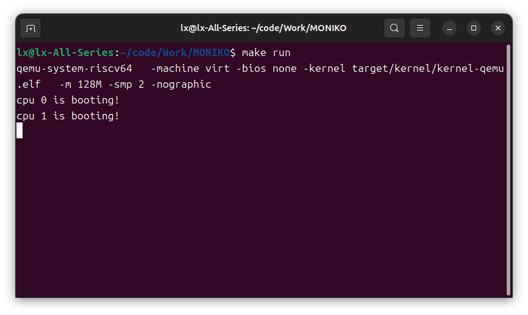

# LAB-1: 机器启动

本次实验实现了 RISC-V 内核的基本启动流程、UART 标准输出、错误处理机制和自旋锁。完成后，内核可以在 QEMU 中以双核方式启动，从 M-mode 切换到 S-mode，进入 `main()`，并通过 `printf()` 输出启动信息。

## 实现内容

本次实验主要完成了以下函数和模块：

- `start()`：完成启动早期的 CSR 配置，从 M-mode 切换到 S-mode 并进入 `main()`
- `spinlock_init()`：初始化自旋锁结构
- `spinlock_holding()`：判断当前 CPU 是否持有指定自旋锁
- `spinlock_acquire()`：通过原子操作获取自旋锁，并在持锁期间关闭中断
- `spinlock_release()`：释放自旋锁，并恢复中断状态
- `print_init()`：初始化 UART 和 `printf` 使用的自旋锁
- `printf()`：实现基本格式化输出
- `panic()`：输出错误信息并停止内核
- `assert()`：在条件不满足时调用 `panic()`
- `main()`：协调双核启动并输出启动信息

## 启动流程

QEMU 启动后会将内核加载到 `0x80000000`，并从 `_entry` 开始执行。`_entry` 位于 `src/kernel/boot/entry.S`，此时 CPU 仍处于 M-mode。

`entry.S` 的主要工作是为每个 CPU 设置独立的启动栈：

```asm
la sp, CPU_stack
li a0, 4096
csrr a1, mhartid
addi a1, a1, 1
mul a0, a0, a1
add sp, sp, a0
call start
```

`CPU_stack` 是在 `start.c` 中定义的数组：

```c
__attribute__((aligned(16))) uint8 CPU_stack[4096 * NCPU];
```

不同 CPU 根据自己的 `mhartid` 计算对应栈顶，避免多个 CPU 共用同一段栈空间。

## M-mode 到 S-mode

`start()` 负责完成进入 `main()` 前的关键配置。

首先关闭分页，当前阶段直接使用物理地址：

```c
w_satp(0);
```

由于切换到 S-mode 后不能再直接访问 M-mode 的 `mhartid`，所以需要提前把当前 CPU 的 hart id 保存到 `tp` 寄存器：

```c
int id = r_mhartid();
w_tp(id);
```

随后修改 `mstatus.MPP`，让 `mret` 返回时进入 S-mode：

```c
uint64 status = r_mstatus();
status &= ~MSTATUS_MPP_MASK;
status |= MSTATUS_MPP_S;
w_mstatus(status);
```

再将 M-mode 的返回地址设置为 `main()`：

```c
w_mepc((uint64)main);
```

最后执行：

```c
asm volatile("mret");
```

CPU 会从 M-mode 切换到 S-mode，并从 `main()` 继续运行。

## 双核启动同步

`main()` 中使用 `started` 变量协调 CPU0 和其他 CPU 的启动顺序。

CPU0 负责初始化输出系统：

```c
if(cpuid == 0){
    print_init();
    printf("cpu %d is booting!\n", cpuid);

    __sync_synchronize();
    started = 1;
}
```

其他 CPU 等待 `started` 被设置后再继续输出：

```c
while(started == 0)
    ;

__sync_synchronize();
printf("cpu %d is booting!\n", cpuid);
```

这样可以保证 `print_init()` 已经完成，避免其他 CPU 在 UART 和 `printf` 锁初始化之前调用 `printf()`。

## 自旋锁

自旋锁用于保护多 CPU 共享资源。本实验中最重要的共享资源是 UART 输出设备。`printf()` 会连续调用 `uart_putc_sync()` 输出多个字符，如果多个 CPU 同时执行 `printf()`，输出可能交错。

自旋锁结构中保存了锁状态、锁名和持锁 CPU：

```c
typedef struct spinlock {
    uint locked;
    char *name;
    int cpuid;
} spinlock_t;
```

获取锁时使用原子指令：

```c
while (__sync_lock_test_and_set(&lk->locked, 1) != 0)
    ;
```

释放锁时使用：

```c
__sync_lock_release(&lk->locked);
```

为了避免持锁期间被中断打断而造成死锁风险，`spinlock_acquire()` 会先调用 `push_off()` 关闭中断，`spinlock_release()` 在释放锁后调用 `pop_off()` 恢复中断状态。

`push_off()` 和 `pop_off()` 维护了一个嵌套计数 `noff`，使得多层关中断可以正确配对恢复，而不是简单地每次 `pop_off()` 都直接打开中断。

## printf 实现

`print_init()` 完成两件事：

```c
uart_init();
spinlock_init(&print_lk, "printf");
```

`printf()` 使用 `stdarg.h` 中的 `va_list` 读取可变参数，并根据格式字符输出不同类型的数据。

本次实验实现的格式包括：

- `%d`：十进制有符号整数
- `%x`：十六进制整数
- `%p`：指针地址
- `%c`：字符
- `%s`：字符串
- `%%`：百分号本身

为了防止多 CPU 输出交错，`printf()` 在输出前获取 `print_lk`，输出结束后释放锁：

```c
spinlock_acquire(&print_lk);
...
spinlock_release(&print_lk);
```

## 错误处理

`panic()` 用于在内核出现严重错误时输出错误信息并停止执行：

```c
printf("panic! %s\n", s);
panicked = 1;
while (1)
    ;
```

`assert()` 用于检查条件是否成立。如果条件不满足，则调用 `panic()`：

```c
if(!condition){
    panic(warning);
}
```

这为后续实验中的内存管理、页表管理和 trap 处理提供了基础调试机制。

## 测试结果

### 编译测试

测试目标：确认 lab1 实现后可以从干净状态完整构建。

测试命令：

```bash
make clean && make build
```

测试结果：构建通过，仅出现链接器关于 RWX segment 的 warning，该 warning 在当前实验框架中可以忽略。

```text
riscv64-linux-gnu-ld: warning: target/kernel/kernel-qemu.elf has a LOAD segment with RWX permissions
```

### 双核启动测试

测试目标：确认两个 CPU 都能完成启动流程，进入 `main()`，并通过 UART 输出启动信息。

测试命令：

```bash
make run
```

运行结果中可以看到：

```text
cpu 0 is booting!
cpu 1 is booting!
```

这说明 `_entry -> start() -> main()` 的启动链路已经打通，CPU0 完成输出初始化后，CPU1 也能继续运行并输出信息。

运行结果：



## 实验结论

本次实验完成了操作系统内核最基础的启动和输出能力。内核可以在 QEMU 中从 M-mode 启动，完成每个 CPU 的栈设置，将 hart id 保存到 `tp`，通过 `mret` 进入 S-mode 并执行 `main()`。

同时，本实验实现了 UART 标准输出、`printf()`、`panic()`、`assert()` 和自旋锁机制。`printf()` 通过自旋锁保护 UART 设备，避免多 CPU 并发输出时发生字符交错。

