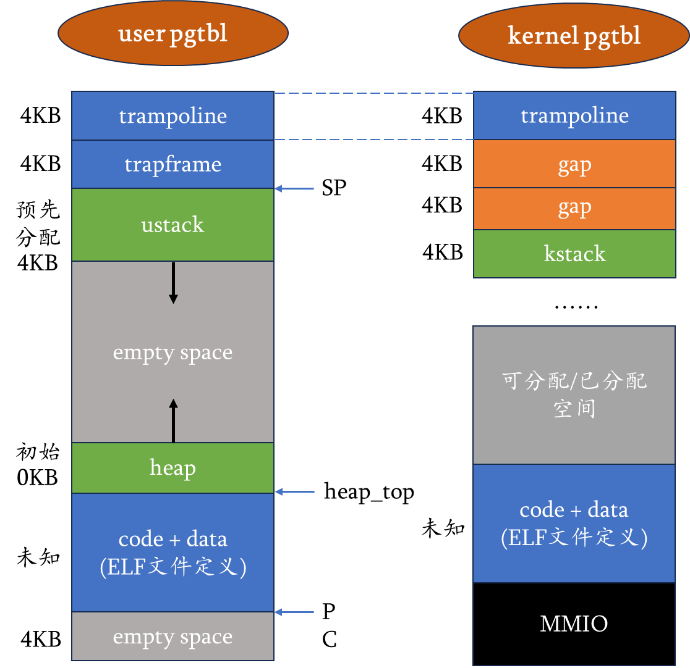
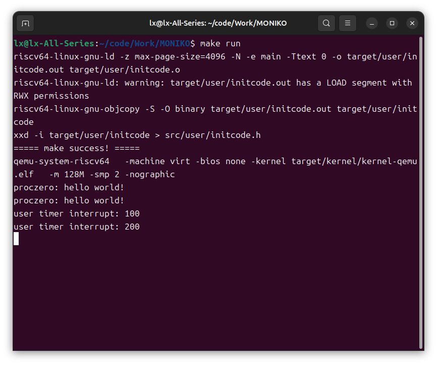

# LAB-4: 第一个用户进程的诞生

## 实验目标

本次实验的目标是在已有前三个Lab完成的基础上，引入第一个用户进程 `proczero`，并打通用户态与内核态之间的系统调用流程。

最终效果：用户程序在 U-mode 中执行 `syscall(SYS_helloworld)`，通过 `ecall` 陷入内核，内核识别系统调用号后输出：

```text
proczero: hello world!
```

同时，本实验还验证了用户态运行期间的时钟中断能够正常进入内核处理。

## 地址空间设计

用户进程运行时涉及两套页表：

- 用户页表：用于 U-mode 执行用户程序，包含用户代码、用户栈、`trapframe` 和 `trampoline`。
- 内核页表：用于 S-mode 执行内核代码，包含内核代码数据、设备 MMIO、可分配物理内存、`trampoline` 和进程内核栈。

地址空间布局如下：



其中比较关键的是 `TRAMPOLINE` 和 `TRAPFRAME`：

- `TRAMPOLINE` 映射到 `trampoline.S` 中的切换代码，并且需要同时出现在用户页表和内核页表的相同虚拟地址处。
- `TRAPFRAME` 保存用户态寄存器现场，以及返回内核时需要恢复的内核页表、内核栈、hartid 和 trap 处理入口。

## 内核页表扩展

在 `kvm_init()` 中，除了原有的 UART、CLINT、PLIC、内核代码段、内核数据段和可分配内存映射外，本实验新增了两类映射：

```c
vm_mappages(kernel_pgtbl, TRAMPOLINE, (uint64)trampoline,
            PGSIZE, PTE_R | PTE_X);

void *kstack = pmem_alloc(true);
vm_mappages(kernel_pgtbl, KSTACK(0), (uint64)kstack,
            PGSIZE, PTE_R | PTE_W);
```

`TRAMPOLINE` 映射保证从用户态陷入内核后，CPU 可以继续执行同一段切换代码。`KSTACK(0)` 是 `proczero` 的内核栈，用户进程进入内核处理系统调用或中断时，内核函数调用栈就使用这页空间。

`KSTACK(procid)` 每隔两个页面安排一个内核栈，其中未映射的一页作为保护页，用于发现内核栈溢出。

## 第一个用户进程

`proc_make_first()` 负责创建第一个用户进程 `proczero`。初始化流程如下：

1. 设置 `pid = 0`。
2. 为 `trapframe` 申请物理页。
3. 创建用户页表，并映射 `TRAMPOLINE` 和 `TRAPFRAME`。
4. 为用户代码申请物理页，将 `initcode` 拷贝进去，并映射到 `USER_BASE`。
5. 为用户栈申请物理页，并映射到 `TRAPFRAME - PGSIZE`。
6. 设置用户态初始 PC 和 SP。
7. 设置进程内核栈和内核态上下文。
8. 将当前 CPU 绑定到 `proczero`。
9. 通过 `swtch()` 切换到 `proczero` 的内核态上下文。

关键字段如下：

```c
p->tf->user_to_kern_epc = USER_BASE;
p->tf->sp = TRAPFRAME;

p->kstack = KSTACK(p->pid);
p->ctx.ra = (uint64)trap_user_return;
p->ctx.sp = p->kstack + PGSIZE;
```

`ctx.ra` 设置为 `trap_user_return` 是本实验中一个重要细节。`swtch.S` 在恢复新上下文后执行 `ret`，此时 `ra` 已经是 `proczero.ctx.ra`，因此控制流会跳转到 `trap_user_return()`，再通过 `trampoline.S` 中的 `user_return` 进入 U-mode。

## 用户态返回与陷入

本实验中的用户态切换由 `trap_user_return()`、`user_return`、`user_vector` 和 `trap_user_handler()` 共同完成。

第一次进入用户态的流程为：

```text
main()
  -> proc_make_first()
  -> swtch(&mycpu()->ctx, &p->ctx)
  -> trap_user_return()
  -> trampoline.S:user_return
  -> sret
  -> U-mode initcode main()
```

用户程序执行系统调用后的流程为：

```text
U-mode syscall(SYS_helloworld)
  -> ecall
  -> trampoline.S:user_vector
  -> 保存用户寄存器到 trapframe
  -> 切换到内核栈和内核页表
  -> trap_user_handler()
  -> trap_user_return()
  -> trampoline.S:user_return
  -> sret 回到 U-mode
```

`trap_user_return()` 的主要工作总体来说包括两个方面：一方面是为下一次从用户态陷入内核做准备，另一方面是为本次返回用户态做准备。

对应代码如下：

```c
void trap_user_return()
{
    proc_t *p = myproc();

    /*
     * 返回用户态的过程会修改 stvec、sepc、sstatus 和页表相关状态，
     * 中途不应该再被中断打断，所以先关闭中断。
     */
    intr_off();
    //下次进入的准备

    /*
     * CPU 之后会回到 U-mode。如果用户态再次发生 syscall、中断或异常，
     * trap 入口应该是 trampoline.S 中的 user_vector。
     *
     * user_vector 在内核链接地址中有一个地址，在 TRAMPOLINE 映射区中
     * 也有一个对应地址。这里计算的是它在 TRAMPOLINE 区域里的虚拟地址。
     */
    uint64 user_vector_addr = TRAMPOLINE + ((uint64)user_vector - (uint64)trampoline);
    w_stvec(user_vector_addr);

    /*
     * user_vector 刚开始运行时还处在用户页表下，所以需要从 trapframe
     * 里取出这些内核信息，然后切回内核页表、内核栈，并跳到
     * trap_user_handler() 继续处理。
     */
    p->tf->user_to_kern_satp = r_satp();                   // 当前内核页表
    p->tf->user_to_kern_sp = p->kstack + PGSIZE;           // 当前进程的内核栈顶
    p->tf->user_to_kern_trapvector = (uint64)trap_user_handler; // 用户态 trap 的内核处理函数
    p->tf->user_to_kern_hartid = r_tp();                   // 当前 CPU 的 hartid

    //回去的准备
    /*
     * sepc 决定 sret 之后用户程序从哪里继续执行。
     * 对第一次进入用户态来说，它是 USER_BASE；
     * 对 syscall 返回来说，它通常已经在 trap_user_handler() 中加过 4。
     */
    w_sepc(p->tf->user_to_kern_epc);

    /*
     * 清除 SPP，表示 sret 的目标特权级是 U-mode；
     * 设置 SPIE，表示回到用户态后允许响应中断。
     */
    uint64 sstatus = r_sstatus();
    sstatus &= ~SSTATUS_SPP;
    sstatus |= SSTATUS_SPIE;
    w_sstatus(sstatus);

    /*
     * 调用 trampoline.S 中映射到 TRAMPOLINE 区域的 user_return。
     * user_return 会切换到用户页表，恢复 trapframe 中保存的用户寄存器，
     * 最后执行 sret 回到 U-mode。
     */
    uint64 user_return_addr = TRAMPOLINE + ((uint64)user_return - (uint64)trampoline);
    void (*fn)(uint64, uint64) = (void (*)(uint64, uint64))user_return_addr;

    /*
     * 参数一必须传 TRAPFRAME 这个虚拟地址，而不是 p->tf。
     * 因为 user_return 切换到用户页表后，只有 TRAPFRAME 这个映射仍然有效。
     *
     * 参数二是用户页表写入 satp 时需要的值。
     */
    fn(TRAPFRAME, MAKE_SATP(p->pgtbl));
}
```

## 系统调用处理

用户程序位于 `src/user/initcode.c`：

```c
int main()
{
    syscall(SYS_helloworld);
    syscall(SYS_helloworld);
    while (1)
        ;
    return 0;
}
```

`syscall()` 最终会执行 RISC-V 的 `ecall` 指令，并将系统调用号放入 `a7` 寄存器。`trampoline.S` 会把用户寄存器保存到 `trapframe`，因此内核可以通过：

```c
p->tf->a7
```

读取系统调用号。

在 `trap_user_handler()` 中，对 U-mode `ecall` 的处理如下：

```c
case 8:
    p->tf->user_to_kern_epc += 4;

    if(p->tf->a7 == SYS_helloworld){
        printf("proczero: hello world!\n");
        p->tf->a0 = 0;
    }else{
        printf("unknown syscall: %d\n", p->tf->a7);
        p->tf->a0 = -1;
    }
    break;
```

这里必须执行：

```c
p->tf->user_to_kern_epc += 4;
```

因为 `sepc` 保存的是 `ecall` 指令本身的地址。如果不加 4，返回用户态后会再次执行同一条 `ecall`，导致系统调用无限重复。

## 用户态中断处理

在用户态运行期间，中断也会先进入 `user_vector`，保存用户寄存器后跳转到 `trap_user_handler()`。

本实验继续复用 LAB-3 中的中断处理逻辑：

- `trap_id = 1`：S-mode software interrupt，用于处理由 M-mode timer interrupt 转发来的时钟中断。
- `trap_id = 9`：S-mode external interrupt，用于处理 UART 外设中断。

对应分支为：

```c
case 1:
    timer_interrupt_handler();
    break;

case 9:
    external_interrupt_handler();
    break;
```

这说明即使 CPU 正在 U-mode 中执行用户程序，时钟中断和串口中断仍然能够进入内核，由内核统一处理，然后再返回用户态继续执行。

## 测试方法

### 系统调用测试

运行：

```bash
make run
```

用户程序执行两次：

```c
syscall(SYS_helloworld);
syscall(SYS_helloworld);
```

预期输出两次：

```text
proczero: hello world!
proczero: hello world!
```

### 用户态时钟中断测试

为了观察用户态时钟中断是否正常触发，测试时临时加入低频输出，例如每 100 个 tick 打印一次：

```text
user timer interrupt: 100
user timer interrupt: 200
```

如果用户程序进入 `while (1)` 后仍能持续输出 tick 信息，说明 CPU 在 U-mode 空转时，时钟中断仍能通过 `user_vector -> trap_user_handler -> timer_interrupt_handler` 正常处理。

## 测试结果

测试截图如下：



从截图中可以看到：

- `make run` 构建并启动 QEMU 成功。
- 用户程序发出的两次 `SYS_helloworld` 系统调用均被内核正确响应。
- 用户态运行期间仍能收到时钟中断，并打印 `user timer interrupt: 100` 和 `user timer interrupt: 200`。

因此，Lab4 的核心功能已经完成：第一个用户进程能够进入 U-mode 执行，能够通过系统调用请求内核服务，并且用户态中断处理链路可以正常工作。

## 总结

本次实验打通了从内核创建用户进程，到用户进程进入 U-mode，再到通过系统调用陷入内核并返回用户态的完整流程。

通过本实验可以更清楚地区分：

- `context`：用于 S-mode 内部的执行流切换，例如 `swtch()` 从内核主流程切到 `proczero` 的内核态执行流。
- `trapframe`：用于 U-mode 与 S-mode 之间保存和恢复完整寄存器现场。
- `trampoline`：用户页表和内核页表共同映射的切换代码，是跨页表、跨特权级切换的桥梁。
- `kstack`：用户进程陷入内核后使用的内核栈，每个进程拥有自己的内核栈。

至此，内核已经具备了最小用户进程能力。
