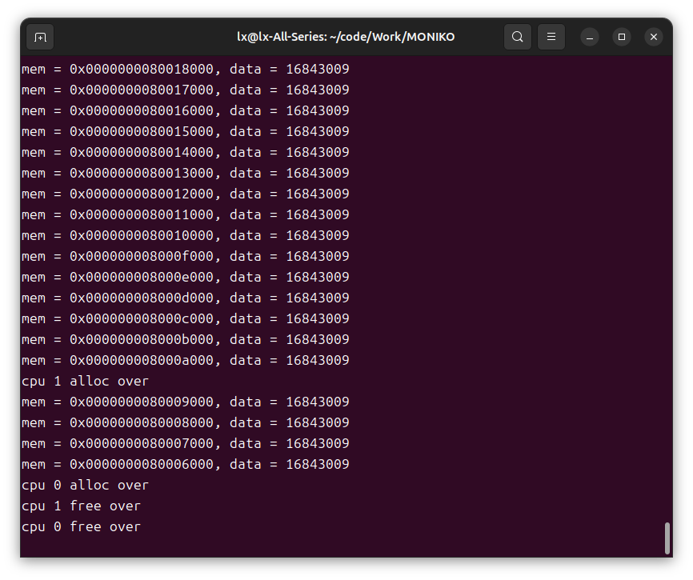
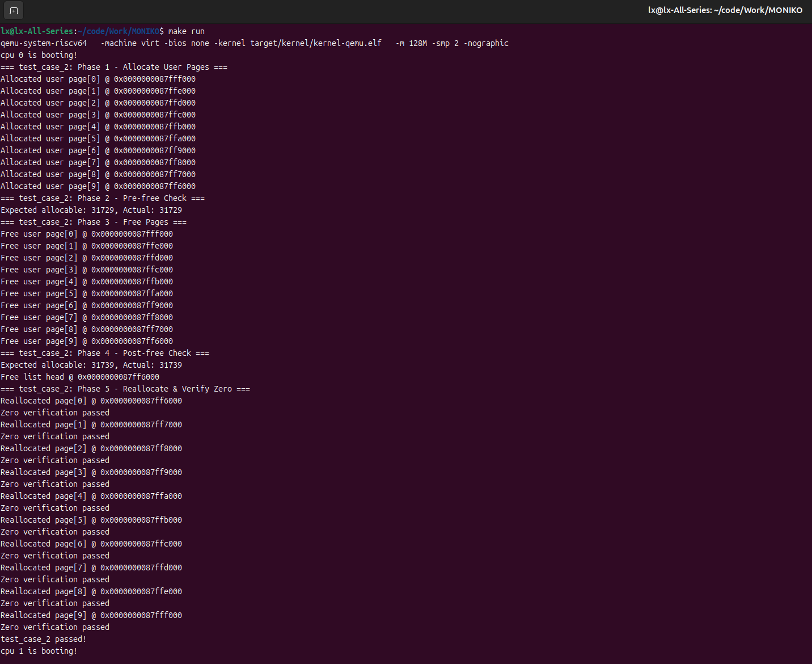
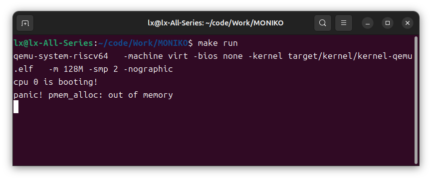
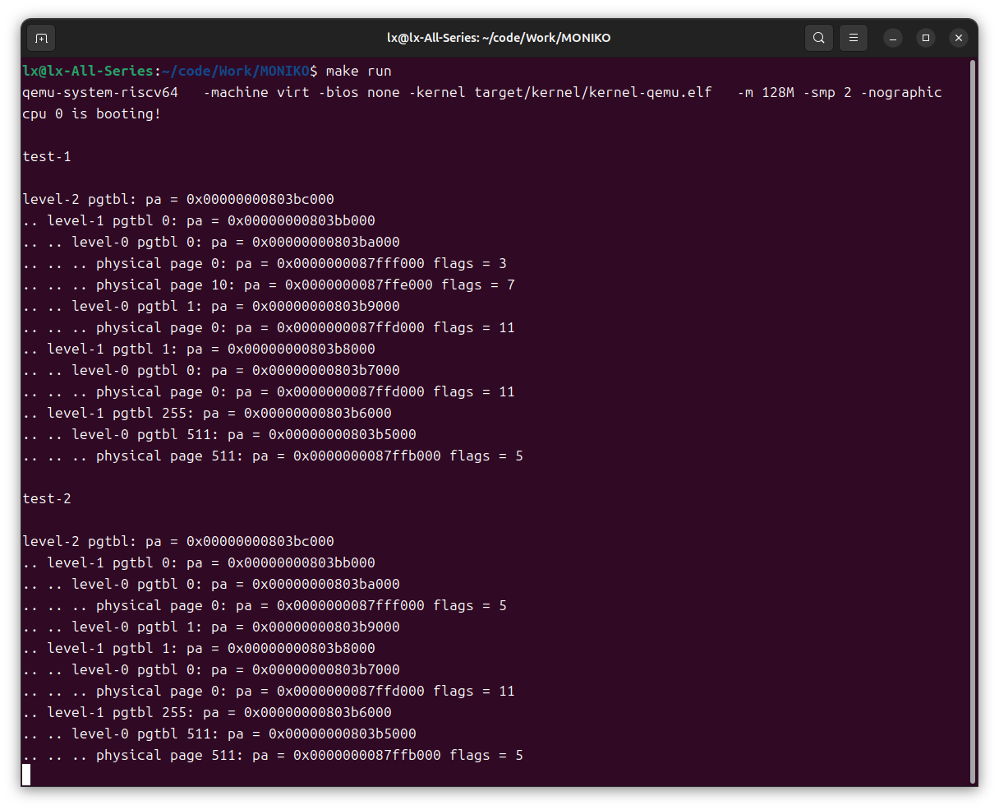
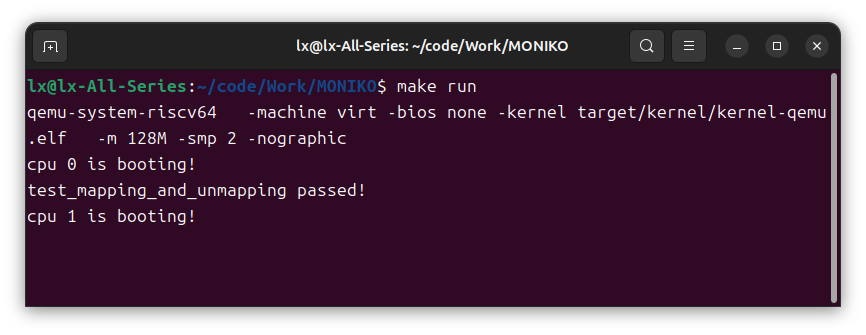

# LAB-2: 内存管理初步

本次实验在 LAB-1 的机器启动、UART 输出和自旋锁基础上，实现了物理页管理和内核态虚拟内存管理。完成后，内核可以初始化物理页分配器，建立内核页表，开启 SV39 地址翻译，并通过测试验证物理页分配、释放、页表映射和解除映射的正确性。

## 实现内容

本次实验主要完成了以下函数：

- `pmem_init()`：初始化内核区和用户区的物理页空闲链表
- `pmem_alloc()`：从指定区域申请一个清零后的 4KB 物理页
- `pmem_free()`：释放一个物理页并重新插入空闲链表
- `vm_getpte()`：根据虚拟地址在三级页表中查找或创建 PTE
- `vm_mappages()`：建立虚拟地址到物理地址的页表映射
- `vm_unmappages()`：解除指定虚拟地址范围的页表映射
- `kvm_init()`：建立内核页表，映射 UART、CLINT、PLIC 和物理内存

## 物理内存

物理内存的可分配区域由 `kernel.ld` 提供：

```text
ALLOC_BEGIN ~ ALLOC_END
```

实验中将这段空间划分为两个区域：

```text
kernel region: [ALLOC_BEGIN, ALLOC_BEGIN + KERN_PAGES * PGSIZE)
user region:   [ALLOC_BEGIN + KERN_PAGES * PGSIZE, ALLOC_END)
```

每个区域由一个 `alloc_region_t` 描述：

```c
typedef struct alloc_region
{
    uint64 begin;
    uint64 end;
    spinlock_t lk;
    uint32 allocable;
    page_node_t list_head;
} alloc_region_t;
```

空闲页通过单链表管理。初始化时将每个 4KB 页转换成 `page_node_t` 插入空闲链表；分配时从链表头取出一页；释放时清零后重新头插回链表。由于物理内存是共享资源，对链表和 `allocable` 的访问使用自旋锁保护。

## 虚拟内存

内核使用 RISC-V SV39 三级页表。虚拟地址通过三级 VPN 查找最终的叶子 PTE：

```text
level-2 -> level-1 -> level-0 -> physical page
```

`vm_getpte()` 从顶级页表开始，根据 `VA_TO_VPN(va, level)` 逐级查找。如果中间页表不存在且 `alloc == true`，则申请新的物理页作为下一级页表。

`vm_mappages()` 负责为 `[va, va + len)` 建立映射。即使 `len` 不是整页大小，只要覆盖到某个页面，就会为该页建立 PTE。

`vm_unmappages()` 负责解除 `[va, va + len)` 内的叶子 PTE。如果 `freeit == true`，同时释放对应的用户物理页。

`kvm_init()` 建立内核页表，采用直接映射：

```text
VA == PA
```

映射内容包括：

- UART 寄存器区域
- CLINT 寄存器区域
- PLIC 寄存器区域
- 内核代码段，权限为 `PTE_R | PTE_X`
- 内核数据和可分配内存区域，权限为 `PTE_R | PTE_W`

## 测试结果

### 物理页并行分配与释放

测试目标：两个 CPU 并行申请内核区域的物理页，写入数据，随后并行释放，验证物理页分配器在多核环境下能正常工作。

测试要点：

- CPU 0 和 CPU 1 分别申请 512 个内核物理页
- 每个页面写入数据并打印地址和值
- 两个 CPU 都完成分配后，再分别释放自己申请的页面
- 测试过程中没有触发 panic，说明空闲链表和锁机制工作正常

运行结果：



### 常规申请、释放与清零验证

测试目标：验证用户物理页的常规申请和释放，以及释放后的页面是否会被清零。

测试要点：

- 连续申请 `TEST_CNT` 个用户页
- 检查申请地址是否位于用户区范围内
- 检查申请后 `allocable` 数量是否减少
- 释放这些用户页
- 检查释放后 `allocable` 数量是否恢复
- 再次申请页面，确认页面内容已被清零

运行结果：



### 内存耗尽测试

测试目标：持续申请物理页直到耗尽，确认 `pmem_alloc()` 能正确触发 panic。

测试方式：

```c
void test_case_1()
{
    while (1)
        pmem_alloc(true);
}
```

运行结果显示，物理页耗尽后正常触发：

```text
panic! pmem_alloc: out of memory
```

运行结果：



### 页表映射与解除映射

测试目标：验证 `vm_mappages()`、`vm_unmappages()` 和 `vm_print()` 的基本功能。

测试要点：

- 为多个虚拟地址建立映射
- 覆盖不同层级的 VPN
- 使用不同权限组合验证 PTE flags
- 对部分虚拟页解除映射
- 使用 `vm_print()` 对比解除映射前后的页表结构

运行结果中，`test-1` 显示初始映射关系，`test-2` 显示解除部分映射后的页表状态。被解除的叶子 PTE 不再显示，中间页表页仍然保留，这符合当前实验未实现页表页回收的设计。

运行结果：



### 映射正确性断言测试

测试目标：通过断言检查 PTE 是否存在、是否有效、物理地址是否匹配、权限位是否正确，以及解除映射后 PTE 是否被清空。

测试要点：

- 建立两个虚拟地址到用户物理页的映射
- 使用 `vm_getpte()` 获取对应 PTE
- 检查 `PTE_V`、`PTE_R`、`PTE_W` 和物理地址
- 调用 `vm_unmappages()` 解除映射
- 再次读取 PTE，确认 `PTE_V` 已清除

运行结果：



## 实验结论

本次实验完成了物理内存管理和内核页表管理的基础功能。物理页分配器能够在多核环境下正确申请和释放页面，并在释放后清零页面内容。页表部分能够创建三级页表、建立映射、更新映射权限、解除叶子 PTE，并通过 `vm_print()` 观察页表结构变化。

最终内核可以调用 `pmem_init()`、`kvm_init()` 和 `kvm_inithart()` 后继续正常运行，说明内核直接映射页表能够支撑当前阶段的内核执行。
